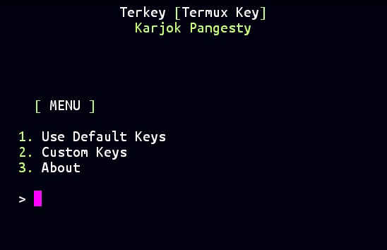

# Terkey
Ferramenta para add mais botões de comando no Termux.

## Como instalar

* `$ pkg update && pkg upgrade`
* `$ pkg install python`
* `$ pkg install git`
* `$ git clone https://github.com/jpmgs1/TermuxKeys`
* `$ cd terkey`
* `$ python terkey.py`


Ou Copie todo o comando abaixo e aperte enter:

```pkg update && pkg upgrade;pkg install python git;git clone https://github.com/jpmgs1/TermuxKeys;cd TermuxKeys;python terkey.py```


## Recursos !

como vc poderá ver, Terkey tem 3 opções,

1. Use Default Keys
1. Custom Keys
1. About

#### 1. Chaves padrão 
Se você escolher esta opção, o programa deixará :

`ESC,/,-,HOME,UP,END,PGUP,TAB,CTRL,ALT,LEFT,DOWN,RIGHT,PGDN`

co ficará seus botões.

#### 2. Chaves personalizadas
Sim, na última atualização, adicionei este recurso útil. Você pode personalizar suas próprias chaves. 
38 Você acabou de poupar suas chaves com vírgulas, como `ESC,CTRL,HOME,UP,RIGHT,{,},(,)` etc.

Todos os comandos Termux [Termux Wiki](https://wiki.termux.com/wiki/Touch_Keyboard)

## Author
Todas informações sobre mim na internet, basta digitar ['Karjok Pangesty'](https://t.me/om_karjok) in your browser !
